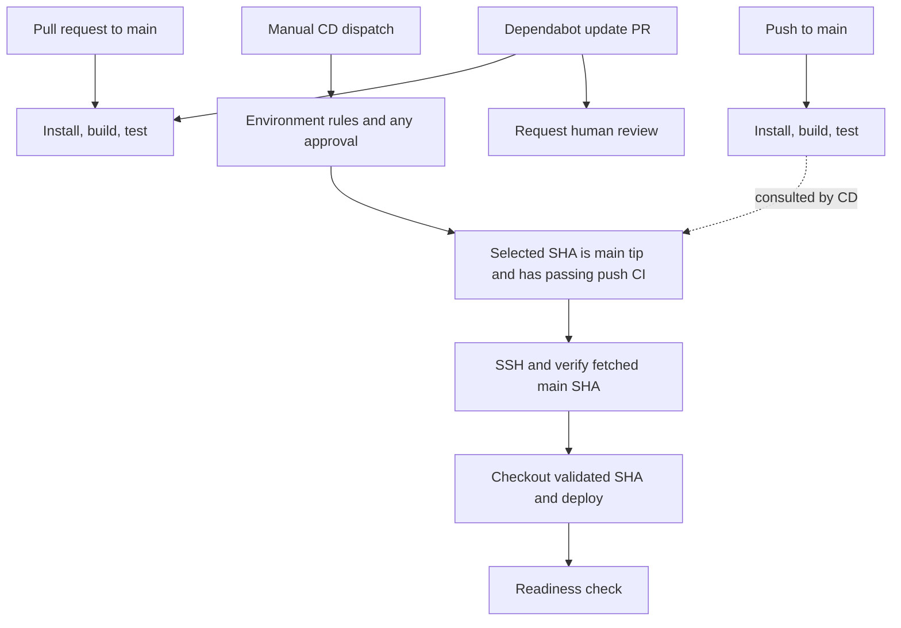

# CI/CD workflow reference from a real project

Added: 2026-10-03

Topic: GitHub Actions

Status: to-review

[GitHub Actions index](README.md) · [Copyable templates and setup guide](../../templates/github-actions/README.md)

## What the original example does

Source: the supplied [workflow folder](<../../inbox/my-example workflow for github/workflows/>) and [deployment notes](<../../inbox/my-example workflow for github/DEPLOYMENT.md>). The original files remain available for comparison. References to issues #23, #25, #30, #31, and #32 belong to that source project; their contents were not supplied.

| File | Trigger | Work | Access |
| --- | --- | --- | --- |
| `ci.yml` | PR targeting `main`, or push to `main` | Checkout, select Node from `.nvmrc`, `npm ci`, build, test | Read repository contents |
| `cd.yml` | Manual `workflow_dispatch` | Validate main tip and successful push CI, SSH, checkout SHA, Compose rollout, migration/demo seed, health request | Read contents/actions plus deployment secrets through `sandbox` |
| `dependabot.yml` | Weekly update schedule | Open GitHub Actions dependency update PRs and assign an owner | Dependabot configuration, not an Actions workflow |
| `dependabot-reviewer.yml` | Selected PR events targeting `main` | For non-draft Dependabot PRs, request a named person's review | Write pull request metadata |

CI and CD are separate workflows: `needs` cannot connect their jobs. The REST API query is the explicit gate between them. A successful CI run grants eligibility for a manual deployment; it does not trigger it. A PR run usually tests a merge ref, so the example requires a separate push run for the exact main commit.

## What is worth keeping

- **CI without deployment credentials.** The build/test job needs repository read access; SSH keys belong with the deploy job.
- **Deliberate deployment.** Manual dispatch, a main-branch check, environment policy, and the CI query express separate conditions.
- **Commit identity.** The workflow validates a SHA and passes that SHA to the server instead of deploying whichever checkout happens to exist.
- **Serialized deployments.** A shared concurrency group prevents two runs in the repository from actively deploying at once.
- **Pinned actions.** Full commit SHAs and readable version comments make the action revision explicit. Dependabot maintains action update PRs.
- **Metadata-only review automation.** The reviewer workflow does not execute PR code with its write token, and safely passes metadata through environment variables.

## Gaps and how the starter handles them

| Observation in the source | Consequence | Template/reference treatment |
| --- | --- | --- |
| Deployment notes say tests are placeholders; lint is commented out | Green CI is not evidence of application correctness | Require real assertions; add project checks explicitly |
| Hardcoded server path, IP/port, project secrets, username, and issue numbers | Copying verbatim carries source-project assumptions | Named customization table; generic placeholders; configurable reviewer |
| CI lookup filters `status=success` | Any matching success can permit deployment even if a newer run failed | Inspect the latest matching run and its current attempt; fail unless completed/successful |
| SSH input has no host fingerprint | The workflow does not configure host identity verification | Require `SERVER_FINGERPRINT` |
| CI and CD have no job timeouts | Hung jobs can consume runner time unnecessarily | Add job timeouts alongside SSH timeout |
| Concurrency is only in GitHub | Server operations from elsewhere can conflict | Add `flock`; document its shared-checkout requirement |
| Remote script silently creates missing secrets | A deployment can alter application configuration unexpectedly | Provision `.env` separately and validate required values |
| Existing empty keys match the original grep checks | An empty password/key may remain empty | Use explicit application/Compose validation |
| Existing `.env` is only touched with `umask 077` | Existing file permissions are not tightened by `touch` | Document explicit restrictive permissions during provisioning |
| App starts before migration and demo seed | Schema incompatibility or unintended data changes may occur | Omit automatic seeding; require a project migration procedure |
| Fixed three-second sleep then one health request | Slow startup produces avoidable failures | Compose readiness wait plus bounded HTTP retries |
| Server builds images from source | Correct source revision does not establish artifact identity | Explain the build-once/image-digest evolution |
| No rollback procedure in supplied YAML | Failed deployment may leave changed runtime state | Document inspection, revert/fix on main, and database-aware recovery limits |

The source's branch check occurs at preflight and again at server fetch. Neither atomically locks the GitHub branch: `main` can advance after fetch. Both the original and starter still deploy the validated SHA. Treat “current main” as a condition checked at those points, not a guarantee that the branch stays unchanged until rollout ends.

The original `DEPLOYMENT.md` reports that four secrets currently exist at repository scope and that the environment permits only `main`. Those are statements in the supplied document; no live repository settings were available for verification.

## Reading a workflow when adapting it

| Key | Meaning | Question to answer in a new project |
| --- | --- | --- |
| `name` | Display name | Will readers recognize the check/deployment? |
| `on` | Events that create a run | PR validation, push validation, scheduled work, or deliberate dispatch? |
| `permissions` | `GITHUB_TOKEN` access | Which API operations does the job actually need? |
| `concurrency` | Which runs share an execution limit | May obsolete CI be cancelled? Which jobs mutate the same target? |
| `jobs` / `runs-on` | Work units and runner selection | What OS, tools, and network access are required? |
| `needs` | Dependencies between jobs in one workflow | Which earlier jobs must succeed? |
| `if` | Conditional execution | Does a skip accidentally hide a required check? |
| `environment` | Deployment environment and protection | Which secrets, branch restrictions, and approvals apply? |
| `steps[].uses` | Invoke an action | Is the action reviewed and pinned to a verified revision? |
| `steps[].run` | Execute shell commands | What shell, directory, exit behavior, and timeout are needed? |
| `with` | Inputs to an action | Do paths and options match this project? |
| `env` / `vars` / `secrets` | Process values, configuration, sensitive values | Does a value belong in version control, settings, or secret storage? |
| `$GITHUB_OUTPUT` | Values passed from a step to later steps | Which validated identifiers need to cross a step boundary? |

For exact syntax and token permission behavior, use the [GitHub workflow syntax reference](https://docs.github.com/en/actions/reference/workflows-and-actions/workflow-syntax). Put user-controlled strings into environment variables and quote their shell expansions instead of interpolating expressions into shell code.

`pull_request_target` is appropriate here only because the review job operates on metadata. Running PR code in that privileged context exposes write access or secrets. Keep build/test work on `pull_request`; see [GitHub's event security guidance](https://docs.github.com/en/actions/reference/workflows-and-actions/events-that-trigger-workflows#pull_request_target). Dependabot-triggered runs have additional token/secret restrictions, so diagnose actual API permissions rather than introducing a broad PAT; see [Dependabot Actions troubleshooting](https://docs.github.com/en/code-security/reference/supply-chain-security/troubleshoot-dependabot/dependabot-on-actions).

## Tests, security checks, and malware scanning

Start with meaningful application tests and security checks that match the project. The starter already runs `npm test` in `ci.yml`; the application must supply the actual test suite. Keep unit tests in CI initially. Add integration tests for database/API interactions and end-to-end tests for critical user flows as needed. Separate test workflows are useful when suites need different environments, schedules, or execution times.

| Check | What it covers | Suggested use |
| --- | --- | --- |
| Build, lint, type checks, and tests | Compilation, code quality, and expected application behavior | PRs and pushes to `main`; make essential checks required |
| Dependency review | Known vulnerabilities introduced by dependency changes | PRs; complement Dependabot alerts and update PRs |
| Code scanning, such as CodeQL | Potential security vulnerabilities and coding errors | Configure supported languages and scan PRs/main; periodic scans can find newly detectable issues |
| Secret scanning and push protection | Supported credential patterns committed to the repository | Enable available repository features; push protection can block supported secrets before a push completes |
| Malware scanning, such as ClamAV | Detectable malware in files, including supported binaries and archives | Consider for bundled third-party files and release artifacts; choose the files to scan explicitly |

Dependency review detects known vulnerable dependency versions; it does not establish that a package is free of malicious code. Code scanning, secret scanning, and antivirus scanning cover different problems. A clean result from any scanner is not proof that the application is safe. GitHub feature availability depends on repository visibility and plan; check the relevant [dependency review](https://docs.github.com/en/code-security/concepts/supply-chain-security/dependency-review), [code scanning](https://docs.github.com/en/code-security/concepts/code-scanning/code-scanning), and [secret scanning](https://docs.github.com/en/code-security/concepts/secret-security/secret-scanning) documentation before choosing the setup.

For an ordinary source-code application, prioritize tests, dependency review, code scanning, and secret protection. Add malware scanning when the files being stored or distributed justify it. [ClamAV](https://docs.clamav.net/) scans files using its detection engine and signature databases; keep those databases current. A repository scan cannot inspect future user uploads. Applications that accept uploads need a runtime scanning/quarantine process before making those files available.

### Make required checks control deployment

The current CD template checks only the latest matching **push run of `ci.yml` for the deployment SHA**. Adding a separate test or security workflow does not automatically make it part of that gate. Requiring checks before merging also does not change what the manual CD preflight verifies.

Choose one approach when extending the templates:

1. Keep required tests and security jobs inside `ci.yml`, so their failures fail the workflow CD already checks. Ensure they actually run on pushes to `main`, and do not mask failures with `continue-on-error` or conditions that skip required work.
2. If separate workflows are necessary, extend CD preflight to verify the latest relevant run/attempt of **every required workflow** for the same deployment SHA, branch, and intended event. Missing, pending, cancelled, skipped, or failed required results must block deployment.

Dependency review is a PR check; do not expect it to produce a push run. Use it as a required merge check, and add an appropriate dependency scan on `main` if deployment must independently verify dependency findings. Likewise, a scanner that uploads alerts but exits successfully does not enforce a severity policy by itself: configure blocking behavior or a suitable protection rule explicitly.

For this DevOps notes repository, prioritize workflow linting, Markdown/local-link checks, and secret scanning. Application tests belong in projects that contain application code. See the [template extension checklist](../../templates/github-actions/README.md#extend-tests-and-security-checks) when copying the starter.

## Transfer the pattern to other projects

| Target | Keep | Adapt |
| --- | --- | --- |
| Another npm application | CI permissions, triggers, lockfile install, manual gate | Node version, scripts, paths, services |
| Python/Go/Java application | CI/CD separation and branch/SHA validation | Runtime setup, locked dependency install, build/test commands, cache, Dependabot ecosystem |
| Monorepo | Explicit gates and stable check names | Working directories, lockfile paths, per-app deployment targets; carefully design path filtering |
| Static site or managed platform | Tests, environment policy, commit identity | Replace SSH/Compose with the provider's deployment mechanism |
| Kubernetes or registry-based deployment | CI quality checks and controlled promotion | Publish a tested image and deploy a digest; add rollout and rollback procedures |
| Production deployment | Reviewed changes and precise release identity | Artifact promotion, approvals, backups, migration strategy, monitoring, recovery rehearsal |

If converting CD to automatic deployment later, design its trigger and trust boundary explicitly. Adding `push` or `workflow_run` changes the approval model. A `workflow_run` handler must validate the source workflow, repository, branch, event, and source SHA; its own `GITHUB_SHA` is not automatically the tested commit.

## Verification and sources

Reviewed 2026-10-03 against the supplied files and upstream documentation. No source application code, actual test suite, GitHub environment settings, or server was supplied. See the [starter validation record](../../templates/github-actions/README.md#validation-record) for local checks and deployment limits.

The action version/SHA pairs from the source were verified against upstream tag references and retained: [checkout v7.0.1](https://github.com/actions/checkout/tree/v7.0.1), [setup-node v7.0.0](https://github.com/actions/setup-node/tree/v7.0.0), and [ssh-action v1.2.5](https://github.com/appleboy/ssh-action/tree/v1.2.5). Pinning an action does not pin every external tool it downloads: this SSH action's [entrypoint](https://github.com/appleboy/ssh-action/blob/0ff4204d59e8e51228ff73bce53f80d53301dee2/entrypoint.sh) downloads a versioned `drone-ssh` release binary at runtime.

The CI query uses the workflow runs API's branch, event, and head-SHA filters; `actions: read` permits reading run results. See [list workflow runs for a workflow](https://docs.github.com/en/rest/actions/workflow-runs#list-workflow-runs-for-a-workflow). Environment behavior, concurrency semantics, SSH inputs, and Compose options are linked beside their setup instructions in the [starter guide](../../templates/github-actions/README.md).
